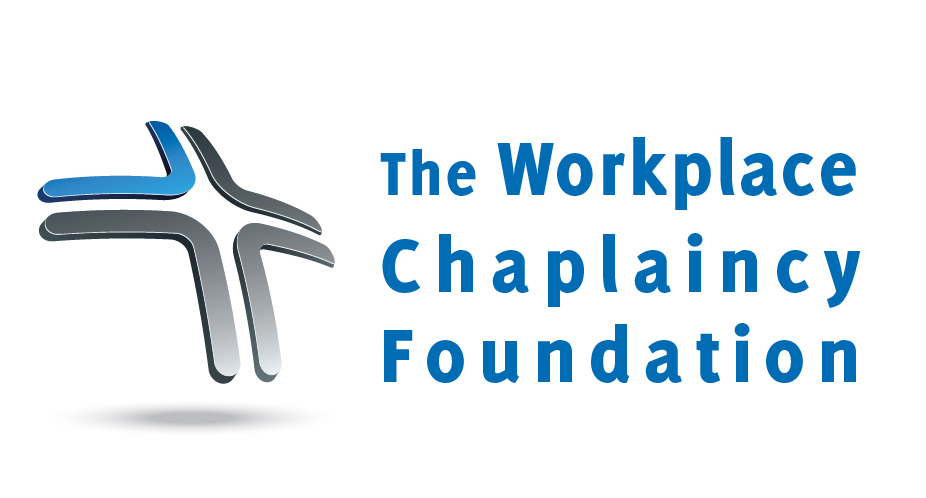

Purpose - This corporation is formed exclusively for charitable and educational purposes as articulated in section 501(c)(3) of the Internal Revenue Code of 1986. The specific purpose of this corporation is to:

- Develop a workplace chaplaincy training and certification program
- Facilitate workplace chaplaincy research and internships
- Provide local, state, and national workplace chaplaincy forums
- Provide international workplace chaplaincy initiatives and consulting
- Provide start-up funds for organizations and municipalities to experience a workplace-based Chaplain Assistance Program (CAP)

Workplace Chaplaincy Foundation, Inc.  
7228 Elmwood Ave.  
Middleton, WI 53562  

**Contact:**  
Steve Cook, President  
608-217-7261  
[Steve@CapChaps.Org](mailto:steve@capchaps.org)
